# Integracion GeoBase <-> dte-spp (Sistema MIR)

> **Documento espejo** -- este archivo es identico en ambos repositorios.
> Ultima actualizacion: 2026-03-19 (post PR #25 en dte-spp)

---

## 1. Vision General

**GeoBase** es el hub geoespacial de la Secretaria de Desarrollo Economico. Actua como
Master Data Management (MDM) de beneficiarios: identidad unica por CURP, georeferencia
con PostGIS, deduplicacion cruzada y evidencia auditable.

**dte-spp** es el sistema de Matriz de Indicadores para Resultados (MIR) que gestiona
el ciclo presupuestal basado en resultados (PbR): programas presupuestarios, indicadores,
metas, avances y medios de verificacion.

La relacion es **complementaria y unidireccional en datos sensibles**: GeoBase posee la
PII de beneficiarios; dte-spp consume agregados y snapshots, nunca datos personales
directamente.

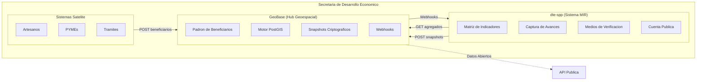

---

## 2. Fundamento Normativo: El Padron como Eje del PbR

> Esta seccion traduce la normatividad del Presupuesto Basado en Resultados (PbR)
> a la arquitectura de software de GeoBase y dte-spp.

### 2.1 Que es un Padron de Beneficiarios

Un **padron de beneficiarios** es la relacion oficial de personas que reciben los beneficios
de un programa gubernamental. Es obligatorio por normatividad, se conforma cada ejercicio
fiscal y es la base para medir si el gasto publico llego a quien debia llegar.

### 2.2 Vinculacion Padron-MIR (5 puntos estructurales)

El padron se vincula con la MIR en cada nivel de su estructura:

| Vinculacion | Nivel MIR | Traduccion en la arquitectura |
|-------------|-----------|-------------------------------|
| **Como Actividad** | Actividad | `POST /beneficiaries` + captura offline = la operacion diaria de administrar el padron |
| **Registro obligatorio en Componentes** | Componente | Separacion `beneficiaries` (identidad) / `enrollments` (transaccion). Endpoint `GET /components/{id}/coverage` |
| **Medio de Verificacion** | Columna 3 | Snapshots criptograficos: CSV + SHA-256 + MinIO. Momento 3 de integracion |
| **Variables de Indicadores Estrategicos** | Fin / Proposito | `COUNT(DISTINCT beneficiary_id)` via `GET /programs/{id}/coverage`. Deduplicacion CURP |
| **Supuestos (factor de riesgo)** | Columna 4 | Poka-yoke geografico `ST_Contains` + comprobante de domicilio. El software verifica el supuesto |

### 2.3 Desagregacion Obligatoria (Anexo 11)

La normativa exige desagregar el padron en variables obligatorias para la Cuenta Publica:

| Variable | Requisito normativo | Implementacion en GeoBase |
|----------|--------------------|-----------------------------|
| **Sexo** | Mujeres / Hombres | `Genero` enum ✅ (masculino, femenino, otro) |
| **Grupo de edad** | Infantes 0-5, Ninios 6-12, Adolescentes 13-17, Jovenes 18-29, Adultos 30-64, Adultos mayores 65+ | `AgeGroupEnum` ❌ (pendiente; se calculara desde `fecha_nacimiento`) |
| **Etnia** | Indigenas / No indigenas | `EthnicityEnum` ❌ (pendiente) |
| **Discapacidad** | Personas con discapacidad | Campo booleano ❌ (pendiente) |

Estos campos son prerequisito para:
- Generar el Anexo 11 "Informacion de la Poblacion Atendida"
- Calcular indicadores estrategicos con perspectiva de genero
- Cumplir con la Agenda 2030 (ODS) en desagregacion estadistica

### 2.4 Clasificacion por Tipo de Indicador

| Tipo | Niveles | Que mide | Endpoint GeoBase |
|------|---------|----------|------------------|
| **Estrategico** | Fin, Proposito, Componentes directos | Impacto real, cobertura, deduplicacion | `GET /programs/{id}/coverage` con `COUNT(DISTINCT)` |
| **De Gestion** | Actividades, Componentes indirectos | Eficiencia operativa del padron | Metricas internas: duplicados resueltos, rechazos geograficos, tiempos de proceso |

### 2.5 Ciclo de Seguimiento MIR traducido a Software

| Etapa normativa | Cuando | En dte-spp | En GeoBase |
|-----------------|--------|------------|------------|
| Captura de metas planeadas | Q1 | Planeador configura `indicador_variables` con `geobase_endpoint_type` | Carga padron base y capas INEGI |
| Registro de avances | Q1-Q4 | Operador usa boton "Sincronizar" en CapturaAvance | API responde con agregados via `GeoBaseClient` |
| Semaforizacion | Cada periodo | `FormulaEvaluatorService` + `SemaforoService` calculan automaticamente | N/A (solo provee datos) |
| Actualizacion de MIR | Cuando cambian ROP | `MirSnapshotService` crea nueva version JSONB | N/A |
| Cierre fiscal | Q4 | Genera Cuenta Publica PDF; almacena hash de snapshot | Emite snapshot final CSV + SHA-256 + MinIO |

### 2.6 Cierre de Ejercicio Fiscal

Al cerrar el anio:

- **dte-spp** congela la MIR (CapturaAvance deshabilita inputs), genera reportes PDF
  definitivos y entrega la Cuenta Publica al Congreso y Auditoria Superior.
- **GeoBase** ejecuta el snapshot final (`POST /snapshots/generate` con `period: 2026-Q4`),
  consolida la Poblacion Atendida (`enrollments WHERE status = 'aprobado'`) y expone
  datos anonimizados via API de Datos Abiertos para transparencia.

La MIR demuestra **que se logro**. El padron demuestra **a quienes se les entrego**.
Juntos cierran el ciclo del PbR.

---

## 3. Ciclo Presupuestal (PbR)

El ciclo anual de Presupuesto basado en Resultados conecta ambos sistemas en cuatro
fases. GeoBase alimenta los numeradores y la evidencia; dte-spp gestiona las metas
y los reportes.

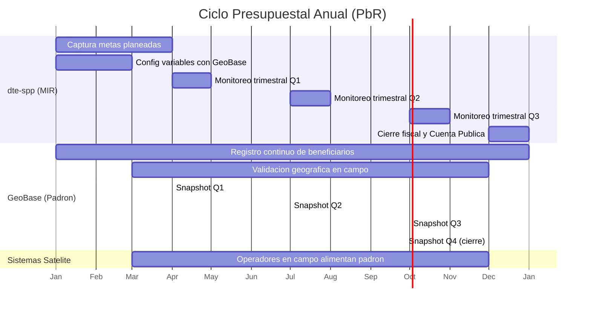

### Detalle por trimestre

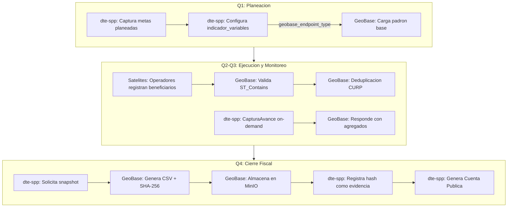

---

## 4. Arquitectura de Integracion

### Endpoints y flujos de datos

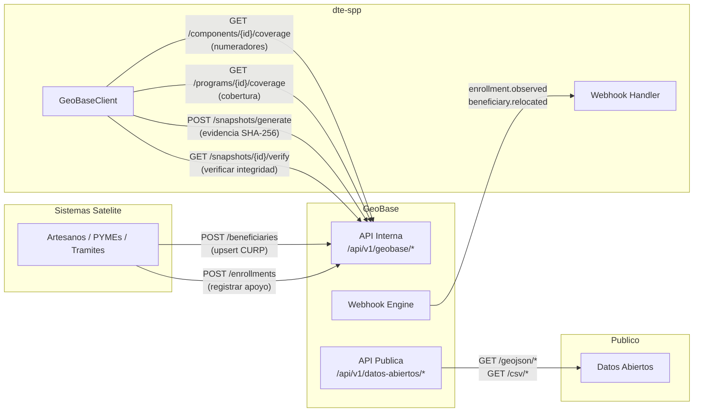

### Secuencia: Sincronizacion de Avance MIR

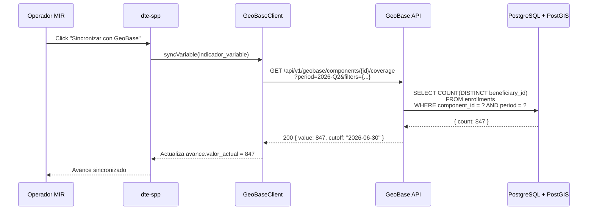

### Secuencia: Generacion de Snapshot

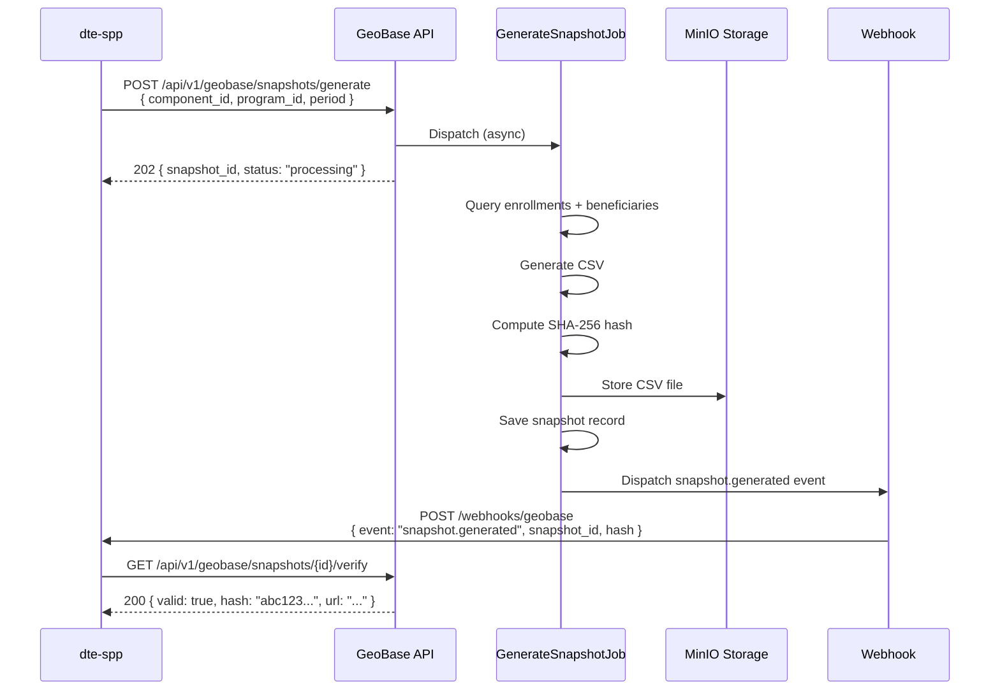

---

## 5. Los 5 Momentos de Integracion

### Momento 1: Variables de Calculo

La tabla `indicador_variables` en dte-spp conecta cada variable de calculo de un
indicador MIR con un endpoint de GeoBase.

| Campo en `indicador_variables` | Tipo | Descripcion |
|-------------------------------|------|-------------|
| `geobase_endpoint_type` | `enum` | `component_coverage`, `program_coverage`, `territorial_report` |
| `geobase_reference_id` | `int` | ID del componente o programa en GeoBase |
| `geobase_filter_params` | `json` | Filtros adicionales: `{ "status": "aprobado", "gender": "femenino" }` |
| `geobase_value_key` | `string` | Campo del response a extraer: `count`, `amount`, `coverage_pct` |

**Flujo:**

```mermaid
flowchart LR
    IV["indicador_variables<br/>(dte-spp)"] -->|geobase_endpoint_type<br/>geobase_reference_id| EP["Endpoint GeoBase"]
    EP -->|response[geobase_value_key]| AV["avances.valor_actual<br/>(dte-spp)"]

    style IV fill:#4a90d9,color:#fff
    style EP fill:#50c878,color:#fff
    style AV fill:#4a90d9,color:#fff
```

| Estado | Sistema |
|--------|---------|
| Columnas `geobase_*` en `indicador_variables` | dte-spp ❌ (migracion pendiente) |
| `geobase_program_id` en `programa_presupuestarios` | dte-spp ✅ (PR #25) |
| `GeoBaseClient` service | dte-spp ✅ (PR #25) |
| Sincronizacion CapturaAvance (boton UI) | dte-spp ❌ |
| Endpoints coverage | GeoBase ✅ |

---

### Momento 2: Cobertura y Deduplicacion

Los indicadores de nivel estrategico (Fin/Proposito) requieren conteo de beneficiarios
unicos. GeoBase garantiza deduplicacion por CURP y validacion espacial con PostGIS.

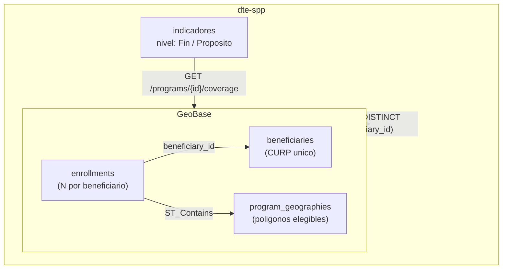

**Query subyacente en GeoBase:**

```sql
SELECT COUNT(DISTINCT e.beneficiary_id) AS cobertura
FROM enrollments e
JOIN beneficiaries b ON b.id = e.beneficiary_id
WHERE e.program_id = :program_id
  AND e.status = 'aprobado'
  AND e.enrollment_date BETWEEN :fecha_inicio AND :fecha_fin
  AND b.activo = true;
```

| Estado | Sistema |
|--------|---------|
| Endpoints coverage | GeoBase ✅ |
| Deduplicacion CURP | GeoBase ✅ |
| Validacion PostGIS | GeoBase ✅ |
| `GeoBaseClient.getProgramCoverage()` | dte-spp ✅ (PR #25) |
| Listener `UpdateAvanceFromEnrollment` | dte-spp ✅ (PR #25) |

---

### Momento 3: Snapshots Criptograficos (Medios de Verificacion)

Cada trimestre, dte-spp solicita un snapshot a GeoBase. El snapshot congela el estado
del padron en un momento dado y produce evidencia inmutable.

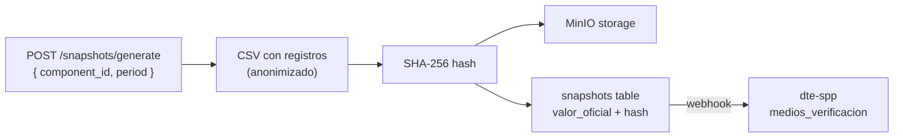

**Tabla `snapshots` en GeoBase:**

| Campo | Tipo | Descripcion |
|-------|------|-------------|
| `component_id` | `int` | Componente del programa |
| `program_id` | `int` | Programa presupuestario |
| `period` | `varchar(10)` | Ejemplo: `2026-Q1` |
| `cutoff_date` | `timestamp` | Fecha de corte |
| `valor_oficial` | `int` | Conteo oficial congelado |
| `snapshot_hash` | `varchar(64)` | SHA-256 del CSV |
| `evidencia_url` | `varchar(500)` | Ruta en MinIO |
| `generated_by` | `varchar(50)` | Sistema que solicito |
| `metadata` | `jsonb` | Desagregados, version |

**Constraint de idempotencia:** `UNIQUE(component_id, program_id, period)` -- un solo
snapshot por componente/programa/periodo.

| Estado | Sistema |
|--------|---------|
| POST /snapshots/generate | GeoBase ✅ |
| GET /snapshots/{id}/verify | GeoBase ✅ |
| GenerateSnapshotJob | GeoBase ✅ |
| SnapshotService | GeoBase ✅ |
| Almacenamiento MinIO | GeoBase ✅ |
| Consumo y almacenamiento de hash | dte-spp ❌ |

---

### Momento 4: Poka-yoke Geografico (Supuestos MIR)

Los supuestos de la MIR asumen que los beneficiarios estan dentro del area de cobertura
del programa. GeoBase valida esto automaticamente al momento de inscripcion.

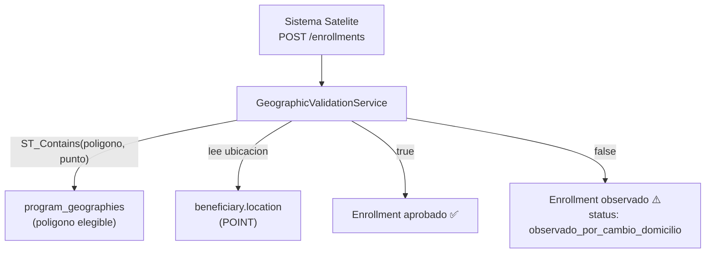

**Validacion PostGIS:**

```sql
SELECT EXISTS (
    SELECT 1 FROM program_geographies pg
    WHERE pg.program_id = :program_id
      AND (pg.component_id = :component_id OR pg.component_id IS NULL)
      AND ST_Contains(pg.poligono_elegibilidad, :beneficiary_location)
      AND (pg.vigencia_fin IS NULL OR pg.vigencia_fin >= CURRENT_DATE)
) AS dentro_de_cobertura;
```

| Estado | Sistema |
|--------|---------|
| GeographicValidationService | GeoBase ✅ |
| program_geographies con PostGIS | GeoBase ✅ |
| Webhook `enrollment.observed` | GeoBase ✅ |
| `WebhookController` + verificacion HMAC | dte-spp ✅ (PR #25) |
| Middleware `VerifyGeoBaseWebhook` | dte-spp ✅ (PR #25) |

---

### Momento 5: Desagregacion Demografica (Anexo 11)

La Cuenta Publica exige desagregacion por genero, grupo de edad, etnia y tipo de
beneficiario. GeoBase almacena estos campos en `beneficiaries` y los incluye en
los snapshots.

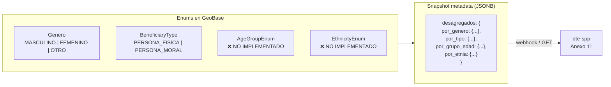

| Estado | Sistema |
|--------|---------|
| `Genero` enum | GeoBase ✅ |
| `BeneficiaryType` enum | GeoBase ✅ |
| `AgeGroupEnum` | GeoBase ❌ |
| `EthnicityEnum` | GeoBase ❌ |
| Desagregados en snapshot metadata | GeoBase ⚠️ (parcial) |
| Consumo Anexo 11 | dte-spp ❌ |

---

## 6. Estado Actual de Implementacion

### GeoBase

| Componente | Estado | Notas |
|-----------|--------|-------|
| API Interna (Sanctum) | ✅ | Scopes configurados |
| POST /beneficiaries (upsert CURP) | ✅ | Con deduplicacion |
| POST /enrollments | ✅ | Con validacion geografica |
| GET /components/{id}/coverage | ✅ | Numeradores por componente |
| GET /programs/{id}/coverage | ✅ | Cobertura por programa |
| POST /snapshots/generate | ✅ | Async via GenerateSnapshotJob |
| GET /snapshots/{id}/verify | ✅ | Verificacion SHA-256 |
| GeographicValidationService | ✅ | ST_Contains poka-yoke |
| SnapshotService | ✅ | CSV + hash + MinIO |
| Webhook engine | ✅ | Con reintentos |
| Enum `Genero` | ✅ | MASCULINO, FEMENINO, OTRO |
| Enum `BeneficiaryType` | ✅ | PERSONA_FISICA, PERSONA_MORAL |
| `vw_reporte_territorial` | ❌ | Vista materializada pendiente |
| `AgeGroupEnum` | ❌ | Requerido para Anexo 11 |
| `EthnicityEnum` | ❌ | Requerido para Anexo 11 |
| API Datos Abiertos | ⚠️ | GeoJSON listo, CSV parcial |

### dte-spp

| Componente | Estado | Notas |
|-----------|--------|-------|
| `GeoBaseClient` service class | ✅ | PR #25 — HTTP + Sanctum + retry + 8 metodos |
| `WebhookController` + ruta POST | ✅ | PR #25 — HMAC-SHA256 verification |
| Middleware `VerifyGeoBaseWebhook` | ✅ | PR #25 — Valida `X-GeoBase-Signature` |
| Eventos: `EnrollmentStatusChanged`, `SnapshotGenerated`, `SyncProcessed` | ✅ | PR #25 |
| Listener `UpdateAvanceFromEnrollment` | ✅ | PR #25 — Refresca cobertura automaticamente |
| `geobase_program_id` en `programa_presupuestarios` | ✅ | PR #25 — Migracion + indice |
| `ProgramaPresupuestario::getGeoBaseCoverage()` | ✅ | PR #25 |
| Config `services.geobase` (url, token, timeout, retry) | ✅ | PR #25 |
| Tests unitarios + integracion + webhook | ✅ | PR #25 — 3 suites de tests |
| Variables `.env` (`GEOBASE_API_URL`, `TOKEN`, `WEBHOOK_SECRET`) | ✅ | Configuradas |
| Columnas `geobase_*` en `indicador_variables` | ❌ | Migracion pendiente |
| Boton "Sincronizar" en CapturaAvance | ❌ | UI Livewire pendiente |
| Almacenamiento de snapshot hash | ❌ | Logica para poblar `hash_archivo` |
| Consumo de desagregados Anexo 11 | ❌ | Depende de GeoBase enums |

---

## 7. Modelo de Datos Compartido

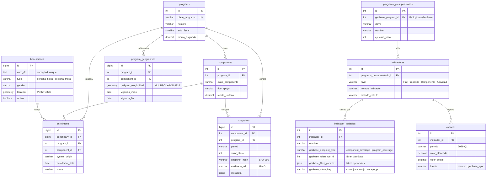

**Relacion clave:** `programa_presupuestarios.geobase_program_id` apunta al `programs.id`
de GeoBase. Esta es una FK logica (no existe constraint fisico entre bases de datos).

---

## 8. Flujo de Datos por Nivel MIR

Cada nivel de la MIR consume datos de GeoBase de forma distinta:

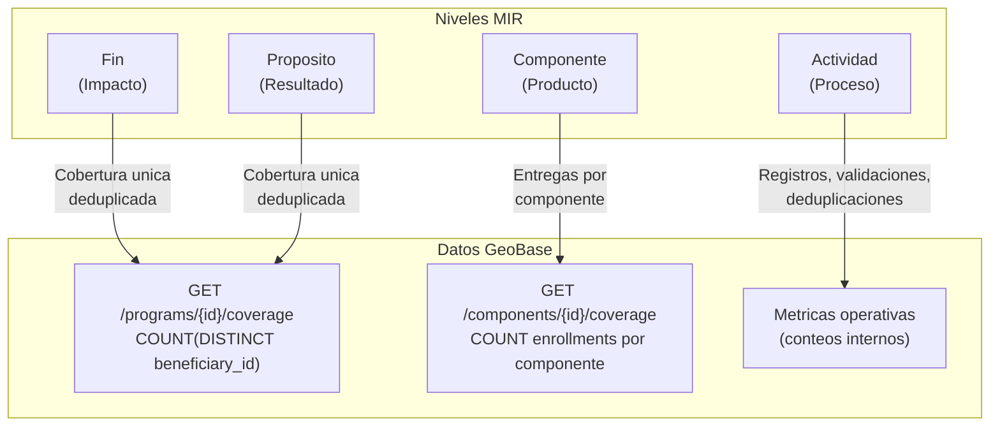

### Detalle por nivel

| Nivel MIR | Tipo de indicador | Endpoint GeoBase | Ejemplo |
|-----------|------------------|------------------|---------|
| **Fin** | Cobertura poblacional | `GET /programs/{id}/coverage` | "% de artesanos atendidos vs padron estatal" |
| **Proposito** | Beneficiarios unicos | `GET /programs/{id}/coverage` | "Numero de beneficiarios unicos del programa" |
| **Componente** | Entregas/apoyos | `GET /components/{id}/coverage` | "Kits entregados en Q2" |
| **Actividad** | Operativos | Metricas internas | "Solicitudes validadas geograficamente" |

---

## 9. Seguridad y Autenticacion

### Tokens Sanctum con Scopes

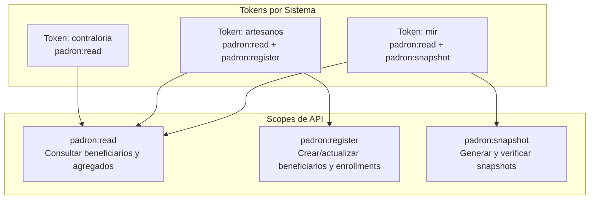

### Capas de seguridad

| Capa | Mecanismo | Ubicacion |
|------|-----------|-----------|
| **Autenticacion** | Laravel Sanctum (Bearer token) | Middleware `auth:sanctum` |
| **Autorizacion** | Scopes por token | Middleware `CheckScope` |
| **Cifrado PII** | Encrypt/decrypt en modelo | `Beneficiary` (curp_rfc, nombre, apellidos, address_street) |
| **Auditoria** | Log de acceso a PII | Middleware `AuditPiiAccess` -> tabla `audit_logs` |
| **Rate limiting** | Throttle por token | Middleware `EnforceRateLimit` |
| **Webhooks** | HMAC-SHA256 signature | Header `X-GeoBase-Signature` |
| **Datos Abiertos** | Anonimizacion obligatoria | Agregados sin PII, rate-limited |

### Cumplimiento LGPDPPSO

| Requisito | Implementacion |
|-----------|---------------|
| Minimizacion de datos | API retorna solo campos necesarios segun scope |
| Cifrado en reposo | Campos PII cifrados con APP_KEY |
| Registro de acceso | `audit_logs` con IP, user_agent, query |
| Derecho de cancelacion | Soft delete + purga programada |
| Transferencia controlada | Solo via API autenticada, nunca exportacion directa |
| Evidencia inmutable | Snapshots con hash; datos originales no se modifican post-generacion |

### Flujo de autenticacion inter-servicio

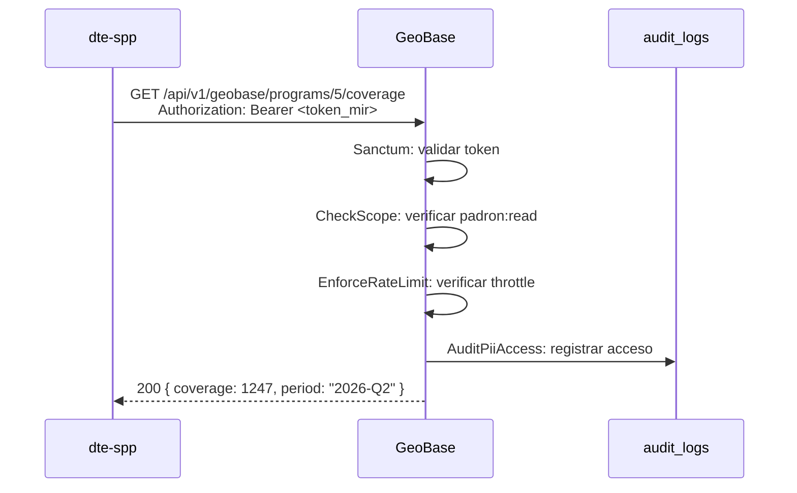

---

## 10. Pendientes de Implementacion

> Actualizado: 2026-03-19. El PR #25 (`feat/geobase-integration`) resolvio la capa de
> comunicacion HTTP, webhooks y vinculacion de programas. Los pendientes restantes son
> de capa de negocio (UI, datos demograficos, reportes).

### En dte-spp

| Tarea | Prioridad | Dependencia | Notas |
|-------|-----------|-------------|-------|
| Columnas `geobase_*` en `indicador_variables` | Alta | Migracion | `geobase_endpoint_type`, `geobase_reference_id`, `geobase_filter_params`, `geobase_value_key` |
| Boton "Sincronizar con GeoBase" en CapturaAvance | Alta | Migracion anterior + GeoBaseClient ✅ | Campo readonly cuando valor viene de GeoBase |
| Almacenar `snapshot_hash` en `avance_evidencias.hash_archivo` | Media | GeoBaseClient ✅ | Columna existe, falta logica para poblarla desde webhook `snapshot.generated` |
| Consumo desagregados para Anexo 11 | Media | AgeGroupEnum + EthnicityEnum en GeoBase | Reporte transversal de genero/edad/etnia |
| Dashboard de estado de integracion | Baja | Todo lo anterior | Widget con ultimo sync, errores, variables vinculadas |
| Job de sync automatico al cierre de periodo | Baja | Boton sincronizar | Sincroniza todas las variables con `geobase_endpoint_type` al cerrar trimestre |

### En GeoBase

| Tarea | Prioridad | Dependencia | Notas |
|-------|-----------|-------------|-------|
| `AgeGroupEnum` | Alta | Definicion rangos Anexo 11 | infantes, ninios, adolescentes, jovenes, adultos, adultos_mayores |
| `EthnicityEnum` | Alta | Catalogo INPI | indigena, no_indigena |
| Campo `discapacidad` en `beneficiaries` | Alta | Migracion | Booleano — requerido por indicadores de inclusion |
| Desagregados completos en snapshot metadata | Media | Enums anteriores | Incluir grupo_edad, etnia, discapacidad en JSONB |
| `vw_reporte_territorial` (vista materializada) | Media | Capas INEGI cargadas | Cruce beneficiarios x municipios x CONEVAL |
| Evento `beneficiary.created` | Baja | WebhookService ✅ | Falta event class + mapping en DispatchWebhooks listener |
| Endpoint `GET /territorial-report/{municipio}` | Baja | vw_reporte_territorial | Reporte pre-calculado por municipio |

### Compartido

| Tarea | Prioridad | Notas |
|-------|-----------|-------|
| ~~Pruebas end-to-end de integracion~~ | ~~Alta~~ | ✅ Resuelto en PR #25 (3 suites) |
| Documentar codigos de error compartidos | Media | 4xx/5xx estandarizados |
| Monitoreo de salud de integracion | Baja | Health check bidireccional |

---

## Apendice A: Configuracion de Red (Desarrollo Local)

| Servicio | Puerto | URL |
|----------|--------|-----|
| dte-spp (app) | 80 | `http://localhost` |
| GeoBase (app) | 8081 | `http://localhost:8081` |
| GeoBase PostgreSQL | 5433 | `localhost:5433` |
| GeoBase Redis | 6380 | `localhost:6380` |
| GeoBase Vite | 5174 | `localhost:5174` |
| dte-spp PostgreSQL | 5432 | `localhost:5432` |
| dte-spp Redis | 6379 | `localhost:6379` |

En desarrollo local, dte-spp se conecta a GeoBase via `http://localhost:8081/api/v1/geobase/`.

## Apendice B: Eventos Webhook

| Evento | Payload | Cuando se dispara |
|--------|---------|-------------------|
| `beneficiary.created` | `{ beneficiary_id, curp_hash }` | Nuevo beneficiario registrado |
| `beneficiary.relocated` | `{ beneficiary_id, old_municipality, new_municipality }` | Cambio de domicilio |
| `enrollment.approved` | `{ enrollment_id, program_id, component_id }` | Inscripcion aprobada |
| `enrollment.observed` | `{ enrollment_id, reason }` | Inscripcion observada (fuera de poligono) |
| `snapshot.generated` | `{ snapshot_id, hash, period, valor_oficial }` | Snapshot completado |
| `duplicate.detected` | `{ primary_id, secondary_id, similarity }` | Posible duplicado |
