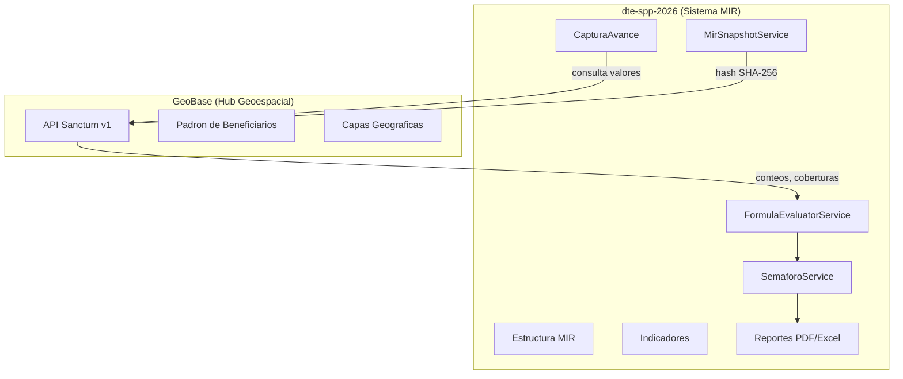
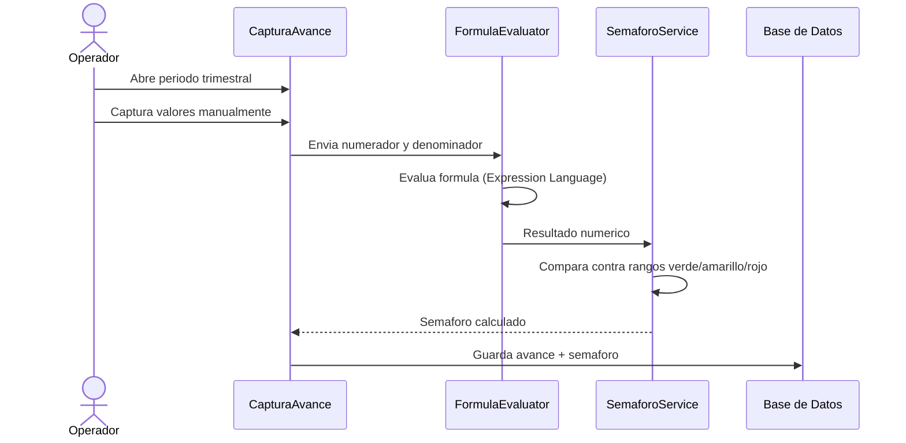
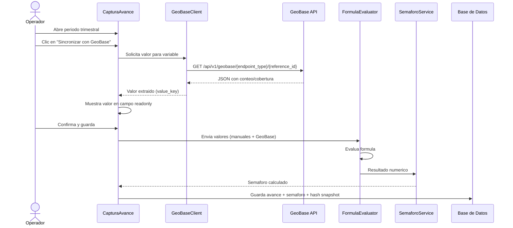
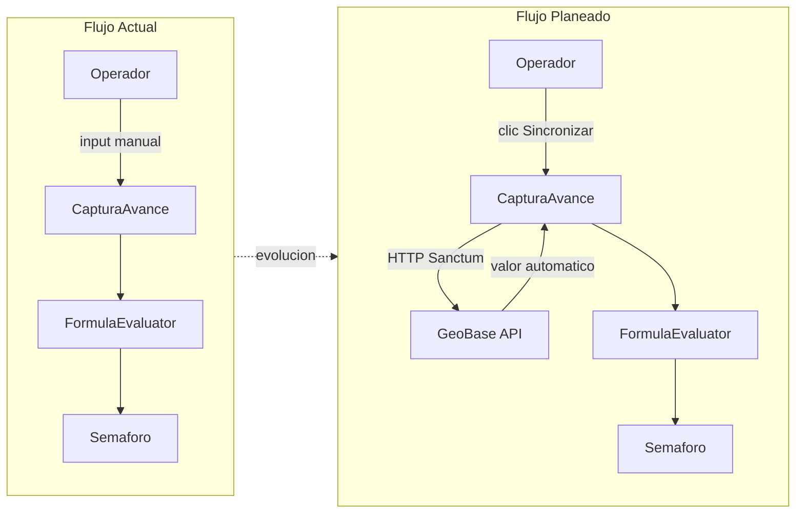
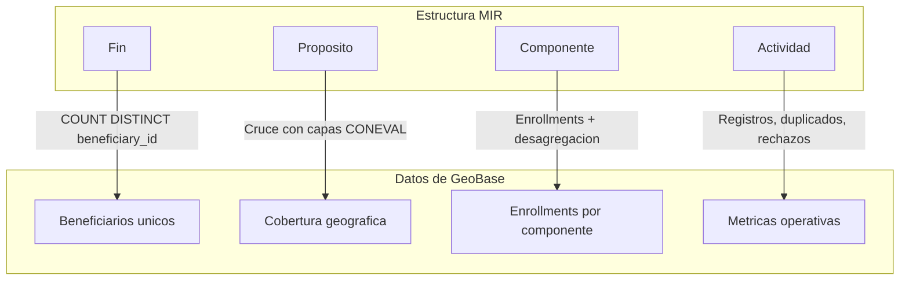
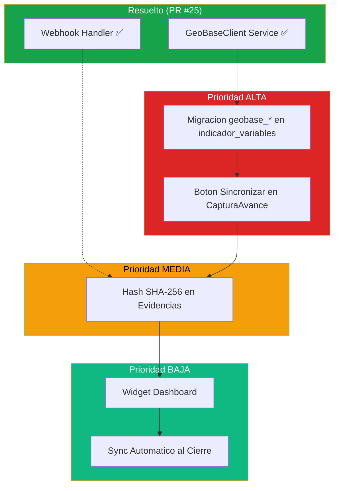

# Rol de dte-spp-2026 en la Integracion con GeoBase

> Documento enfocado exclusivamente en las responsabilidades de dte-spp
> y lo que consume del hub geoespacial GeoBase.

---

## 1. Rol de dte-spp en el Ecosistema

dte-spp-2026 es el **sistema de evaluacion MIR** (Matriz de Indicadores para Resultados)
de la Secretaria de Desarrollo Economico. Es el dueno de:

| Responsabilidad                | Detalle                                                        |
|--------------------------------|----------------------------------------------------------------|
| Estructura MIR                 | 4 niveles: Fin, Proposito, Componente, Actividad               |
| Indicadores                    | Tipos estrategico y de gestion                                 |
| Evaluacion de formulas         | `FormulaEvaluatorService` con Symfony Expression Language       |
| Logica de semaforo             | `SemaforoService` con rangos verde/amarillo/rojo                |
| Ejercicio fiscal               | Gestion de anio fiscal y seguimiento de periodos               |
| Reportes PDF/Excel             | 8 exportaciones PDF + 14 exportaciones Excel                   |
| Versionado MIR                 | Snapshots en `mir_versiones` con JSONB                          |



---

## 2. Como dte-spp Consume GeoBase

### Esquema de base de datos ya preparado

La base de datos de dte-spp ya cuenta con las columnas necesarias para vincular
indicadores con GeoBase.

**Tabla `programa_presupuestarios`:**

- `geobase_program_id` (bigint nullable) — vincula el programa presupuestario
  con su equivalente en GeoBase.

**Tabla `indicador_variables`:**

| Columna                  | Tipo         | Descripcion                                          |
|--------------------------|--------------|------------------------------------------------------|
| `geobase_endpoint_type`  | varchar(20)  | Tipo de endpoint, e.g. `component_count`, `program_count` |
| `geobase_reference_id`   | bigint       | ID del componente/programa en GeoBase                |
| `geobase_filter_params`  | json         | Filtros, e.g. `{"status": "aprobado"}`               |
| `geobase_value_key`      | varchar(30)  | Clave a extraer de la respuesta API                  |

### Implementado (PR #25 — `feat/geobase-integration`)

| Componente | Ubicacion | Descripcion |
|-----------|-----------|-------------|
| `GeoBaseClient` | `app/Services/GeoBase/GeoBaseClient.php` | 8 metodos HTTP + Sanctum + retry + timeout configurable |
| `GeoBaseException` | `app/Services/GeoBase/GeoBaseException.php` | Exception con statusCode y responseBody |
| `WebhookController` | `app/Http/Controllers/GeoBase/WebhookController.php` | Despacha `enrollment.status_changed`, `snapshot.generated`, `sync.processed` |
| `VerifyGeoBaseWebhook` | `app/Http/Middleware/VerifyGeoBaseWebhook.php` | Validacion HMAC-SHA256 via `X-GeoBase-Signature` |
| Eventos GeoBase | `app/Events/GeoBase/` | 3 eventos: `EnrollmentStatusChanged`, `SnapshotGenerated`, `SyncProcessed` |
| Listener | `app/Listeners/GeoBase/UpdateAvanceFromEnrollment.php` | Refresca cobertura al recibir cambio de enrollment |
| Migracion | `2026_03_18_010000_add_geobase_program_id...` | `geobase_program_id` en `programa_presupuestarios` |
| Modelo | `ProgramaPresupuestario` | Metodos `hasGeoBaseLink()`, `getGeoBaseCoverage()` |
| Config | `config/services.php` → `geobase` | url, token, webhook_secret, timeout, retry_times, retry_sleep |
| Tests | `tests/Unit/...`, `tests/Feature/...` | GeoBaseClientTest, GeoBaseIntegrationTest, WebhookControllerTest |

### Lo que falta construir

| Prioridad | Componente                          | Descripcion                                              |
|-----------|-------------------------------------|----------------------------------------------------------|
| ALTA      | Columnas `geobase_*` en `indicador_variables` | `geobase_endpoint_type`, `geobase_reference_id`, `geobase_filter_params`, `geobase_value_key` |
| ALTA      | Boton sincronizar en CapturaAvance  | Campo readonly cuando GeoBase esta conectado             |
| MEDIA     | Logica para poblar `hash_archivo`   | Webhook `snapshot.generated` → guardar hash en `avance_evidencias` |
| BAJA      | Widget de dashboard                 | Estado de conexion con GeoBase                           |
| BAJA      | Sync automatico al cierre de periodo| Sincronizacion sin intervencion manual                   |

---

## 3. Flujo de Captura de Avance (Actual vs. Planeado)

### Flujo actual (manual)



### Flujo planeado (con GeoBase)



### Comparativa de flujos



---

## 4. Servicios Existentes que Participan en la Integracion

| Servicio                    | Ubicacion                                          | Rol en la integracion                              |
|-----------------------------|----------------------------------------------------|----------------------------------------------------|
| `FormulaEvaluatorService`   | `app/Services/FormulaEvaluatorService.php`         | Evalua formulas de indicadores; recibira valores de GeoBase como variables |
| `SemaforoService`           | `app/Services/SemaforoService.php`                 | Calcula semaforo verde/amarillo/rojo a partir del resultado de la formula |
| `AvanceEstadoService`       | `app/Services/AvanceEstadoService.php`             | Gestiona transiciones de estado del avance (borrador, capturado, validado) |
| `CalendarioService`         | `app/Services/CalendarioService.php`               | Maneja calendarios de periodos; define ventanas de sincronizacion |
| `MirSnapshotService`        | `app/Services/MirSnapshotService.php`              | Genera snapshots JSONB de la MIR; almacenara hashes de evidencia GeoBase |
| `GeoBaseClient` *(por crear)* | `app/Services/GeoBaseClient.php`                 | Cliente HTTP para consumir la API Sanctum de GeoBase |

---

## 5. Configuracion Existente

Las variables de entorno ya estan definidas en el `.env` de dte-spp:

```env
GEOBASE_API_URL=http://host.docker.internal:8081/api/v1/geobase
GEOBASE_API_TOKEN=<token-sanctum-configurado>
GEOBASE_WEBHOOK_SECRET=<secreto-hmac-configurado>
```

| Variable                | Proposito                                                    |
|-------------------------|--------------------------------------------------------------|
| `GEOBASE_API_URL`       | URL base de la API v1 de GeoBase (via Docker network)        |
| `GEOBASE_API_TOKEN`     | Token Sanctum para autenticacion machine-to-machine          |
| `GEOBASE_WEBHOOK_SECRET`| Secreto HMAC para validar webhooks entrantes desde GeoBase   |

> **Nota:** Se usa `host.docker.internal` porque ambos sistemas corren en
> contenedores Docker/Sail separados (dte-spp en puerto 80, GeoBase en 8081).

---

## 6. Exportaciones que Usan Datos del Padron

### Exportaciones PDF que necesitaran datos de GeoBase

| Exportacion                     | Necesita GeoBase | Dato requerido                                    |
|---------------------------------|------------------|---------------------------------------------------|
| `MirPdfExport`                  | Si               | Valores de indicadores calculados desde el padron |
| `FichaTecnicaPdfExport`         | Si               | Definiciones de variables vinculadas a GeoBase    |
| `AvanceTrimestralPdfExport`     | Si               | Avance trimestral con valores del padron          |
| `EvaluacionAnualPdfExport`      | Si               | Cobertura anual y datos acumulados                |
| `ConcentradoCapturaPdfExport`   | Si               | Resumen de captura con fuentes mixtas             |
| `TransversalPdfExport`          | Si               | Desagregacion por genero/demografica del padron   |
| `SemaforoPdfExport`             | No               | Solo usa resultados ya calculados internamente    |
| `ComparativoPdfExport`          | No               | Comparativa entre periodos (datos internos)       |

Las exportaciones marcadas con "Si" deberan mostrar un indicador visual
cuando el valor proviene de GeoBase (fuente automatica vs. captura manual).

---

## 7. Niveles MIR y su Consumo de GeoBase



| Nivel MIR    | Tipo de indicador | Endpoint GeoBase          | Dato consumido                                      |
|--------------|-------------------|---------------------------|-----------------------------------------------------|
| **Fin**      | Estrategico       | `beneficiary_count`       | `COUNT(DISTINCT beneficiary_id)` — impacto real, deduplicado |
| **Proposito**| Estrategico       | `coverage_geographic`     | Cobertura geografica, cruce con zonas CONEVAL        |
| **Componente**| Gestion          | `component_count`         | Enrollments por componente, con desagregacion        |
| **Actividad**| Gestion          | `program_count`           | Metricas operativas: registros, duplicados, rechazos |

> El nivel **Fin** es el mas critico porque requiere deduplicacion real
> de beneficiarios, algo que solo GeoBase puede garantizar con su registro maestro.

---

## 8. Pendientes de Implementacion en dte-spp

> Actualizado: 2026-03-19. El PR #25 resolvio GeoBaseClient, webhooks y vinculacion
> de programas. Los pendientes restantes son de capa de negocio.

### Prioridad ALTA

1. **Migracion: columnas `geobase_*` en `indicador_variables`**
   - `geobase_endpoint_type` (varchar 20): `component_coverage`, `program_coverage`, `territorial_report`
   - `geobase_reference_id` (bigint nullable): ID del componente/programa en GeoBase
   - `geobase_filter_params` (json nullable): filtros como `{"status": "aprobado", "gender": "femenino"}`
   - `geobase_value_key` (varchar 30 nullable): campo a extraer: `count`, `amount`, `coverage_pct`
   - Prerequisito para el boton de sincronizacion

2. **Boton "Sincronizar" en CapturaAvance**
   - Solo visible cuando la variable tiene `geobase_endpoint_type` configurado
   - Al hacer clic: llama a `GeoBaseClient` ✅, llena el campo como readonly
   - El operador puede ver el valor pero no modificarlo
   - Indicador visual de "fuente: GeoBase" junto al campo
   - Fallback: si GeoBase no responde, permitir captura manual con advertencia

### Prioridad MEDIA

3. **Logica para poblar `hash_archivo` desde webhook**
   - La columna `avance_evidencias.hash_archivo` ya existe ✅
   - Falta: al recibir webhook `snapshot.generated`, guardar `snapshotHash` en el registro
   - Verificar integridad al generar reportes PDF
   - Incluir hash en la ficha tecnica como evidencia MIR

### Prioridad BAJA

4. **Widget de dashboard**
   - Tarjeta en el dashboard principal mostrando estado de conexion
   - Ultimo sync exitoso, errores recientes
   - Conteo de variables vinculadas vs. manuales

5. **Sincronizacion automatica al cierre de periodo**
   - Job programado que se ejecuta al cerrar un trimestre
   - Sincroniza todos los indicadores con `geobase_endpoint_type`
   - Genera notificacion al responsable si hay discrepancias



---

## Referencias

- Diseno completo de GeoBase: `geobase/docs/plans/2026-03-17-geobase-design.md`
- API GeoBase: `geobase/routes/api/geobase.php`
- Esquema de variables: `dte-spp-2026` migration `indicador_variables`
- Configuracion Docker: `dte-spp-2026/docker-compose.yml`
