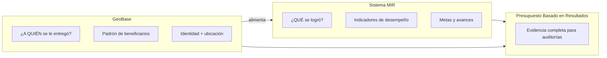
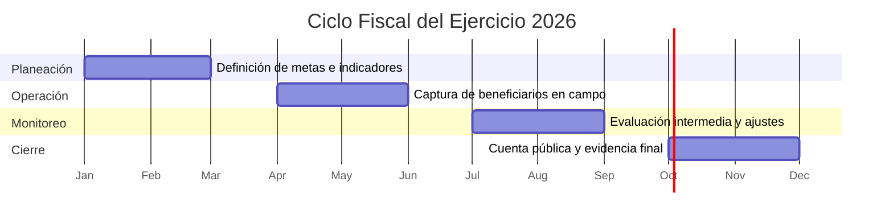
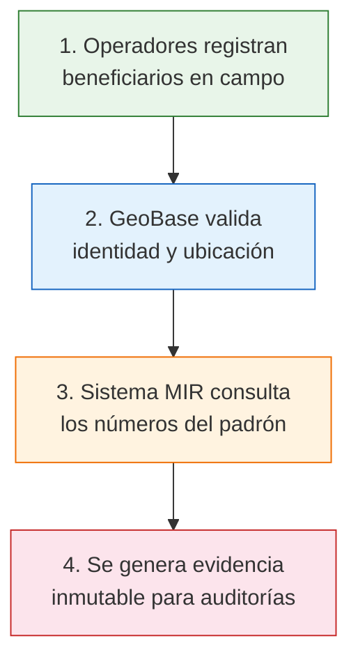
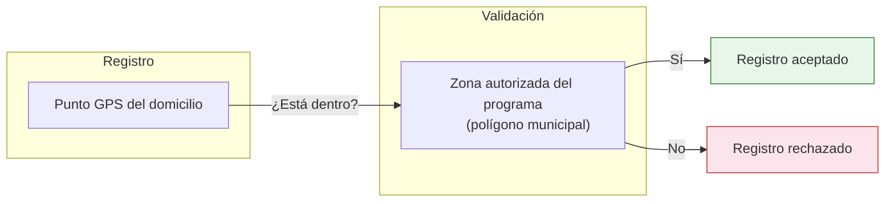
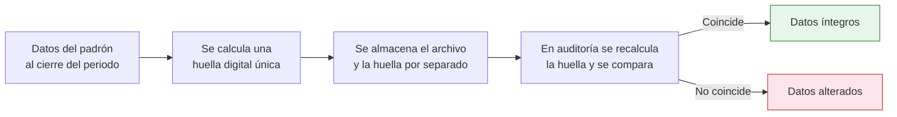
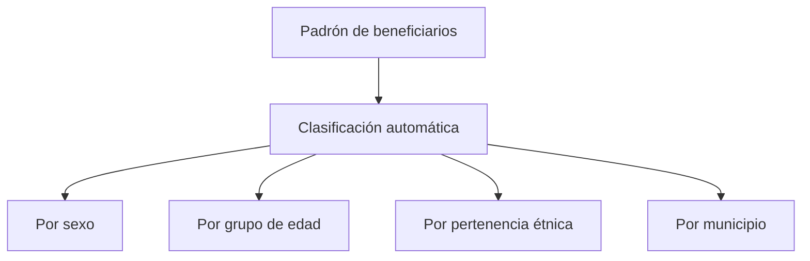
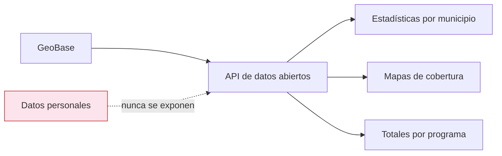
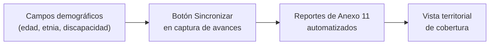

# Integración GeoBase ↔ Sistema MIR

**Secretaría de Desarrollo Económico del Estado de Oaxaca**
Marzo 2026

> Documento espejo — idéntico en ambos repositorios (`geobase` y `dte-spp-2026`).

---

## ¿Qué es un Padrón de Beneficiarios?

Un **padrón de beneficiarios** es el registro oficial de todas las personas que reciben apoyos de un programa gubernamental.

- **Es obligatorio** por normatividad federal y estatal.
- **Se conforma cada ejercicio fiscal** (enero a diciembre).
- **Es la base** para medir si el gasto público llegó a quien debía llegar.

Sin un padrón confiable, no es posible saber cuántas personas fueron atendidas, dónde viven ni si se cumplieron las metas del programa.

---

## ¿Por qué dos sistemas?

Cada sistema resuelve una pregunta distinta. Juntos, hacen posible el Presupuesto Basado en Resultados.

| | GeoBase | Sistema MIR |
|---|---|---|
| **Pregunta** | ¿A quién se le entregó? | ¿Qué se logró? |
| **Contenido** | Personas, lugares, evidencia | Indicadores, metas, avances |
| **Usuarios** | Operadores de campo, enlace municipal | Responsables de programa, evaluadores |

---

## El Ciclo Anual

Ambos sistemas trabajan en sincronía con el ejercicio fiscal.

- **Primer trimestre:** se definen los programas, las metas y las zonas de atención.
- **Segundo trimestre:** los operadores registran beneficiarios en campo.
- **Tercer trimestre:** se revisa el avance y se ajustan estrategias.
- **Cuarto trimestre:** se cierra el ejercicio y se genera la evidencia para auditoría.

---

## ¿Cómo Trabajan Juntos?

El flujo completo, desde el registro en campo hasta la auditoría, funciona de forma continua.

**En la práctica esto significa:**

1. El operador llega a la comunidad, captura los datos del beneficiario y toma la georreferencia.
2. GeoBase verifica que la persona no esté duplicada y que su domicilio esté dentro de la zona autorizada.
3. El Sistema MIR obtiene automáticamente cuántos beneficiarios van registrados para calcular sus indicadores.
4. Al cerrar el periodo, se genera un archivo sellado digitalmente que nadie puede alterar.

---

## Validación Geográfica Automática

El sistema impide registrar beneficiarios fuera de las zonas autorizadas del programa.

**¿Cómo funciona?**

- Cada programa tiene definidas las zonas geográficas donde puede operar (municipios, localidades).
- Al registrar un beneficiario, el sistema compara su ubicación contra esas zonas.
- Si el punto está fuera del área autorizada, el registro se rechaza automáticamente.
- Esto elimina errores humanos y evita registros en zonas no autorizadas.

---

## Evidencia a Prueba de Manipulación

Al cerrar un periodo, el sistema genera evidencia que no se puede alterar sin dejar rastro.

**En palabras simples:**

- La "huella digital" es un código único generado a partir de todos los datos del padrón.
- Si alguien cambia aunque sea un solo dato después del cierre, la huella ya no coincide.
- Esto garantiza que la información presentada en cuenta pública es exactamente la misma que se capturó.

---

## Indicadores que se Calculan Solos

La conexión entre sistemas elimina la captura manual de cifras en los indicadores.

**Antes (proceso manual):**

| Paso | Riesgo |
|---|---|
| El operador cuenta beneficiarios en una hoja de cálculo | Error de conteo |
| Envía el número por correo al responsable del programa | Demora, pérdida de información |
| El responsable teclea el número en el sistema de indicadores | Error de captura, posible manipulación |

**Ahora (proceso automático):**

| Paso | Garantía |
|---|---|
| GeoBase lleva el conteo en tiempo real | Cifra siempre actualizada |
| El Sistema MIR consulta el número directamente | Sin intermediarios |
| El dato queda bloqueado y no se puede editar a mano | Integridad total |

El resultado: los indicadores reflejan exactamente lo que ocurre en el padrón, sin posibilidad de ajustar las cifras.

---

## Desagregación Automática

El sistema clasifica a los beneficiarios por características demográficas sin intervención manual.

**¿Para qué sirve?**

- **Anexo 11 del PEF:** requiere reportar cuántas mujeres y cuántos hombres fueron atendidos.
- **Agenda 2030 (ODS):** exige información desagregada para medir avance en los objetivos de desarrollo.
- **Equidad de género:** permite verificar que el presupuesto beneficia de forma equitativa a mujeres y hombres.

Toda esta información se genera directamente del padrón, sin que nadie tenga que clasificar a mano.

---

## Transparencia y Datos Abiertos

Cualquier persona puede consultar información agregada de los programas, sin acceso a datos personales.

- **API pública:** cualquier ciudadano o periodista puede consultar cuántos beneficiarios hay por municipio.
- **Mapas interactivos:** visualización geográfica de la cobertura de cada programa.
- **Sin datos personales:** nombres, CURP y domicilios nunca se exponen. Solo se publican cifras agregadas.
- **Cumplimiento normativo:** alineado con la Ley General de Protección de Datos Personales en Posesión de Sujetos Obligados.

---

## ¿Qué Garantiza esta Integración?

La conexión entre GeoBase y el Sistema MIR asegura cinco pilares fundamentales:

| Pilar | Descripción |
|---|---|
| **Identidades verificadas** | No hay beneficiarios duplicados ni registros fantasma. |
| **Ubicaciones validadas** | Cada beneficiario está dentro de la zona autorizada del programa. |
| **Números auditables** | La evidencia criptográfica impide alterar datos después del cierre. |
| **Reportes automáticos** | Los indicadores se alimentan directamente del padrón, sin captura manual. |
| **Transparencia total** | Datos abiertos para la ciudadanía, sin exponer información personal. |

---

## Fundamento Normativo

Esta integración responde a obligaciones legales del Presupuesto Basado en Resultados (PbR):

| Obligación | Cómo se cumple |
|---|---|
| **Registro obligatorio** de beneficiarios en programas que entregan bienes/servicios | GeoBase rechaza registros incompletos (validación automática) |
| **Desagregación** por sexo, edad, etnia y discapacidad (Anexo 11) | Campos demográficos obligatorios en el padrón |
| **Medios de verificación** auditables e inmutables | Snapshots criptográficos con huella SHA-256 |
| **Deduplicación** de la población atendida | Registro único por CURP, conteo con `DISTINCT` |
| **Focalización geográfica** en zonas prioritarias | Validación automática contra polígonos autorizados |
| **Transparencia** y datos abiertos | API pública sin datos personales |

---

## Estado Actual

| Componente | Estado |
|---|---|
| Padrón digital de beneficiarios | ✅ Operativo |
| Validación geográfica automática | ✅ Operativo |
| Evidencia criptográfica (snapshots) | ✅ Operativo |
| Conexión HTTP entre sistemas (GeoBaseClient) | ✅ Operativo |
| Recepción de webhooks en MIR | ✅ Operativo |
| Vinculación programas MIR ↔ GeoBase | ✅ Operativo |
| Botón "Sincronizar" en captura de avances | 🔄 En desarrollo |
| Desagregación demográfica completa (Anexo 11) | 🔄 En desarrollo |
| Reportes automáticos de indicadores | 🔄 En desarrollo |
| Datos abiertos y mapas públicos | 🔄 En desarrollo |

---

## Próximos Pasos

1. **Completar campos demográficos en GeoBase**
   Agregar grupo de edad (calculado desde fecha de nacimiento), pertenencia étnica y discapacidad para cumplir con el Anexo 11.

2. **Botón "Sincronizar" en captura de avances**
   Los indicadores del Sistema MIR se alimentarán directamente desde el padrón, eliminando toda captura manual.

3. **Reportes de Anexo 11 automatizados**
   La desagregación por sexo, grupo de edad y etnia se generará automáticamente para cumplir con los requerimientos federales y la Agenda 2030.

4. **Vista territorial de cobertura**
   Mapas interactivos que muestren, municipio por municipio, el alcance de cada programa, cruzado con capas de marginación CONEVAL.

---

> **Secretaría de Desarrollo Económico del Estado de Oaxaca**
> Dirección de Planeación — Marzo 2026
